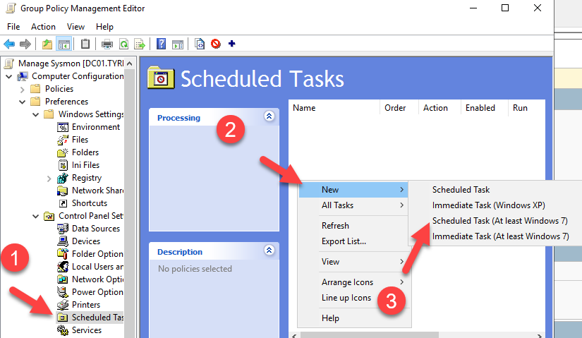

# Sysmon-Manager
This repo contains information on how to auto deploy Sysmon via GPO and Task Scheduler

## Installation
1. Login to Windows using an account that has permission to write to your domain controllers Sysvol. # Example - \\yourdomain.int\sysvol
2. Create a folder under your domain called sysmon # Example - \\yourdomain.int\sysvol\yourdomain.int\sysmon
3. Download and extract Microsoft Sysmon into the above folder. Make sure sysmon.exe and sysmon64.exe are placed directly into the folder created at step # 2.
4. Download a sysmon configuration file and place it into the folder created during step # 2. # Recommendation - Use Sysmon Modular's configuration file https://raw.githubusercontent.com/olafhartong/sysmon-modular/master/sysmonconfig.xml
5. Download **sysmon_controller.ps1** from this repository and place it into the folder created during step # 2
6. Modify sysmon_controller.ps1 so that $shared_sysmon_folder points to the folder created at step # 2 and modify $local_sysmon_folder if you'd like tracking files to be placed in a different local folder
7. Create a Group Policy Object (GPO) and link it to the machines you want Sysmon managed. The GPO settings should be similar to the GPO settings found below.

## GPO Settings

Use the documentation below to create a group policy that will push and manage Sysmon for any computers linked to the GPO.

1. Under Computer Configuration -> Preferences -> Control Panel Settings -> Scheduled Tasks, create a new Scheduled Task.

2. Set the Action to Create. Set the name to Manage Sysmon (or whatever your preference is). Change the user to NT AUTHORITY\System. Set it to Run whether user is logged on or not. Then set Run with highest privileges.
3. Switch to the Triggers tab. Click on New. Set the Settings to Daily at 12:00:00 AM. Set repeat task to every 5 minutes or your preferred time frame. Also, set Stop all running tasks at end of repetition duration. Then click ok.
4. Switch to the Actions tab. Click on New. Set program/script to powershell.exe. Then under Add arguments enter "-ExecutionPolicy Bypass -File \\yourdomain.int\sysvol\yourdomain.int\sysmon\sysmon_controller.ps1". Substitute your domain for yourdomain.int and do not include the double quotes. Click Ok.
5. Click on the Settings tab. Check Run task as soon as possible after a scheduled start is missed. Then click OK to save the scheduled task.
6. You can now close out of the group policy
